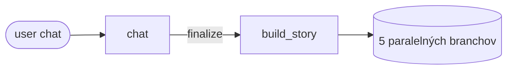
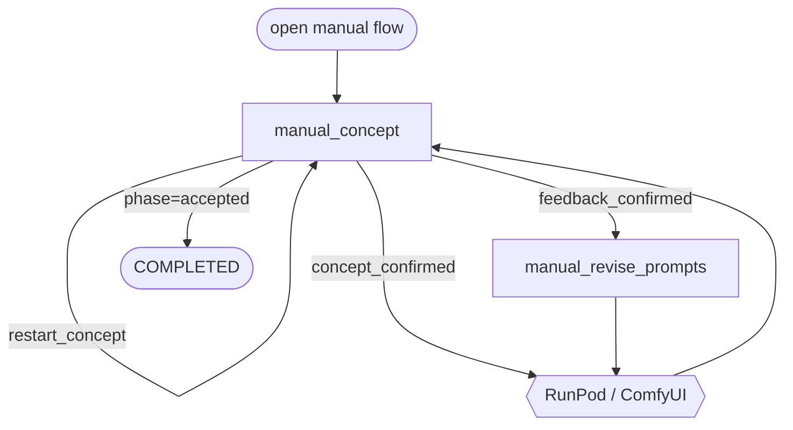

# Anime Illustrator – Agent Flow

Schematický prehľad volaní Claude agentov a RunPod/ComfyUI v jednom behu (story
creation → 5 ilustrácií → manuálny fallback). Agenti sú očíslovaní v špecifikácii
(Agent 0a, 0b, 1, …) — v diagrame uvádzame iba ich kanonické názvy zhodné s
filenames v `backend/app/agents/`.

## 1. Story creation (jednorazovo na začiatku)

- **chat** — vedie konverzáciu v jazyku používateľa a postupne zbiera *creative
  brief* (cast, hlavná postava, téma, voliteľné poznámky).
- **build_story** — z confirmovaného briefu vyrobí samotný príbeh, style guide,
  5 uzamknutých prostredí a register narratívnych entít; vyberie aj 5 single-
  character scén, z ktorých sa stanú ilustrácie.

## 2. Per-illustration auto-pipeline (beží paralelne pre každú z 5 scén)

- **generate_prompts** — premení aktuálny *concept* na ComfyUI positive/negative
  Danbooru tagy a vyberie variant workflowu (no-lora / single-lora).
- **RunPod / ComfyUI** — vyrenderuje obrázok podľa workflowu; pri timeoute robí
  až `RUNPOD_TIMEOUT_RETRY` retry s čerstvým seedom (countery sa nehýbu).
- **evaluate_image** — 8-bodový checklist nad obrázkom; vráti `ok`, alebo
  `problem ∈ {prompt, concept, environment}` + odôvodnenie, ktoré rozhodne
  o ďalšom kroku.
- **revise_prompts** — drobné chirurgické úpravy positive/negative promptov
  podľa konkrétneho verdiktu (zostáva v rámci toho istého konceptu).
- **rethink_concept** — keď prompt úpravy zlyhajú: navrhne *úplne iný* vizuálny
  koncept pre danú scénu a prepíše okolitý odsek tak, aby do príbehu sedel.
- **rethink_environment** — jediný agent oprávnený vymeniť uzamknuté prostredie
  slotu; volá sa iba keď je problémom renderovateľnosť samotného prostredia,
  max. raz za branch (predĺži concept budget o +1).
- **salvage** — keď automatika vyčerpá oba budgety, prejde históriou nuance-only
  near-missov a buď akceptuje jeden ako finálny obrázok, alebo všetko zamietne
  a postúpi branch do manuálneho flow.

## 3. Manuálny fallback (§ 6A, len keď salvage zamietne)

- **manual_concept** — vedie s používateľom dvojfázový chat: najprv vyjednáva
  koncept (gathering → confirmation → confirmed), po prvom renderi prepne do
  feedback režimu a riadi ďalšie iterácie či reštarty konceptu.
- **manual_revise_prompts** — v manuálnom režime preloží konkrétny user
  feedback do prepísaných ComfyUI positive/negative promptov pre ďalší render.

## 4. Translate (mimo render-flow, na požiadanie frontendu)

- **translate** — preloží story title, paragrafy a koncepty do cieľového
  jazyka pri zmene jazyka v UI; výsledky sa cachujú per-run, takže každý text
  ide cez Claude maximálne raz na jazyk.
