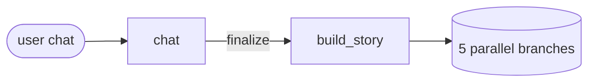
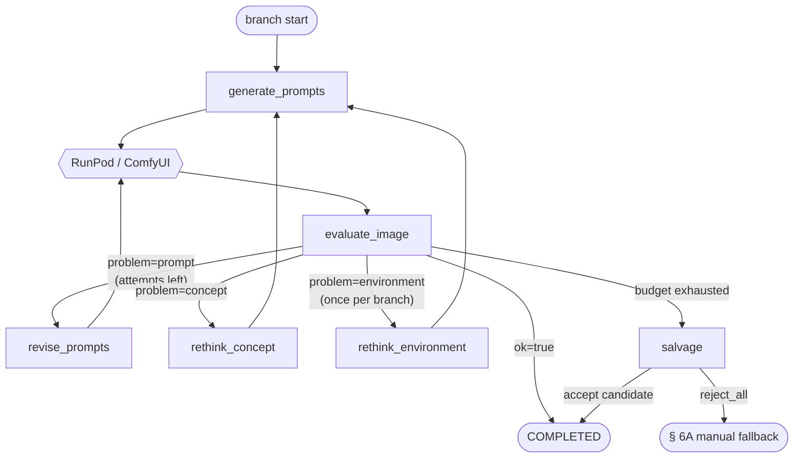
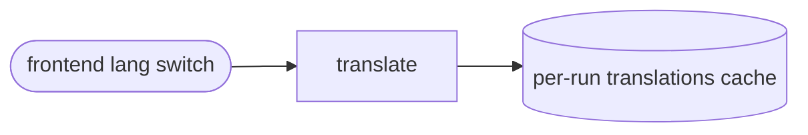

# Anime Illustrator – Agent Flow

A schematic overview of Claude agent and RunPod/ComfyUI calls within a single
run (story creation → 5 illustrations → manual fallback). Agents are numbered
in the spec (Agent 0a, 0b, 1, …) — the diagrams use only their canonical names,
which match the filenames in `backend/app/agents/`.

## 1. Story creation (one-shot at the start)

- **chat** — runs the conversation in the user's language and gradually
  collects a *creative brief* (cast, main character, theme, optional notes).
- **build_story** — turns the confirmed brief into the actual story, a style
  guide, 5 locked environments and a register of narrative entities; it also
  picks the 5 single-character scenes that become the illustrations.

## 2. Per-illustration auto-pipeline (runs in parallel for each of the 5 scenes)

- **generate_prompts** — converts the current *concept* into ComfyUI
  positive/negative Danbooru tags and picks a workflow variant
  (no-lora / single-lora).
- **RunPod / ComfyUI** — renders the image according to the workflow; on
  timeout it retries up to `RUNPOD_TIMEOUT_RETRY` times with a fresh seed
  (the counters are not bumped).
- **evaluate_image** — an 8-point checklist over the image; returns `ok`, or
  `problem ∈ {prompt, concept, environment}` plus a justification that decides
  the next step.
- **revise_prompts** — small surgical edits to the positive/negative prompts
  based on the specific verdict (stays within the same concept).
- **rethink_concept** — when prompt edits fail: proposes a *completely
  different* visual concept for the scene and rewrites the surrounding
  paragraph so it still fits the story.
- **rethink_environment** — the only agent allowed to swap a slot's locked
  environment; invoked only when the environment itself is the rendering
  blocker, at most once per branch (extends the concept budget by +1).
- **salvage** — when automation exhausts both budgets, walks the history of
  nuance-only near-misses and either accepts one as the final image or rejects
  everything and hands the branch over to the manual flow.

## 3. Manual fallback (§ 6A, only when salvage rejects)

- **manual_concept** — runs a two-phase chat with the user: first it negotiates
  the concept (gathering → confirmation → confirmed); after the first render it
  flips into feedback mode and orchestrates further iterations or concept
  restarts.
- **manual_revise_prompts** — in manual mode, translates concrete user
  feedback into rewritten ComfyUI positive/negative prompts for the next
  render.

## 4. Translate (outside the render flow, on demand from the frontend)

- **translate** — translates the story title, paragraphs and concepts into the
  target language when the UI language is switched; results are cached per run
  so each text goes through Claude at most once per language.
